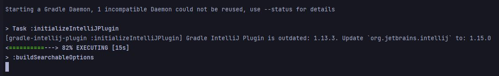
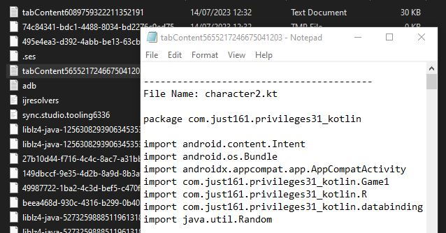

# Tabs_2_TXT_Plugin for Android Studio

## Description
Tabs_2_TXT_Plugin is a simple Android Studio plugin developed to save the content of all open tabs in a single .txt file.

## Installation
1. Clone the Project
2. Build the Plugin.zip (./gradlew buildPlugin or gradlew.bat buildPlugin)
3. Navigate to File -> Settings -> Plugins.
4. Click on the gear icon -> Install Plugin from Disk....
5. Locate the downloaded .zip file and click OK.
6. Restart Android Studio to activate the plugin.

## Usage
After the plugin has been successfully installed:

1. Navigate to the Tools menu on the toolbar.
2. Find the Save Tab Contents To File option and click on it.
3. All open tabs content will be saved into a single .txt file.
4. Find this file in your tmp-folder (make sure to back it up)

## Compatibility
This plugin is compatible with Android Studio versions starting from 203.6668.168. The compatibility range will be updated as the plugin gets updated.

## Support
If you encounter any problems or have any suggestions for this plugin, feel free to open an issue on this GitHub page.

## License
This project is licensed under the terms of the MIT license.

